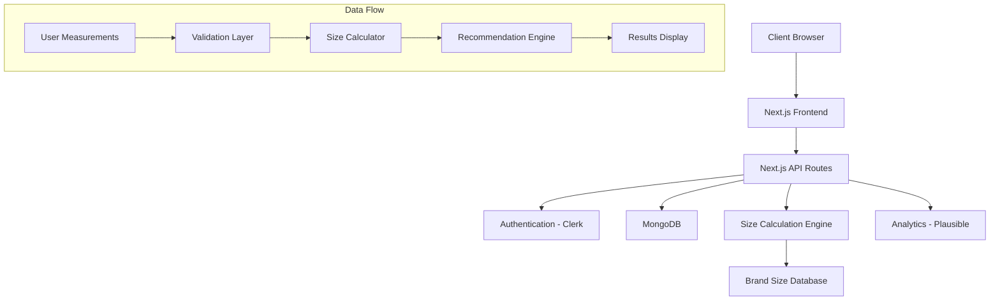

# Smart Clothing Size Calculator - Project Plan

## Feasibility & Initial Assessment

### Key Challenges/Risks

#### 1. Measurement Accuracy
- **Risk**: Inaccurate size predictions could hurt user trust
- **Impact**: High
- **Mitigation**: Start with basic measurements and expand gradually, implement confidence scores

#### 2. Data Quality
- **Risk**: Inconsistent measurement inputs from users
- **Impact**: Medium
- **Mitigation**: Clear input guidelines, validation checks

#### 3. Brand Size Variations
- **Risk**: Different brands have different sizing standards
- **Impact**: High
- **Mitigation**: Start with a limited set of well-documented brands, build a size mapping database

## 30-Day Agile Iteration Plan

### EPIC 1: Core Infrastructure (Days 1-7)
**Description**: Set up project foundation and basic infrastructure

**Tasks**:
1. Initialize Next.js project with TypeScript
2. Set up MongoDB schemas
3. Implement Clerk authentication
4. Configure Tailwind/DaisyUI
5. Set up CI/CD pipeline with Vercel

**Acceptance Criteria**:
- Project builds successfully
- Authentication flow works
- Database connections established
- Basic styling system implemented

### EPIC 2: Measurement Input System (Days 8-14)
**Description**: Create user measurement input interface

**Tasks**:
1. Design measurement input form
2. Implement validation logic
3. Create measurement storage system
4. Build user profile system

**Acceptance Criteria**:
- Users can input/save measurements
- Input validation prevents invalid data
- Measurements persist between sessions
- Clear error messaging

### EPIC 3: Size Calculation Engine (Days 15-21)
**Description**: Develop core sizing algorithm

**Tasks**:
1. Implement basic size calculation logic
2. Create brand size mapping system
3. Build recommendation engine
4. Develop confidence scoring

**Acceptance Criteria**:
- Accurate size predictions for basic measurements
- Support for at least 3 major clothing brands
- Confidence score generated for each prediction

### EPIC 4: User Interface & Results (Days 22-28)
**Description**: Build results display and user dashboard

**Tasks**:
1. Create results visualization
2. Implement size history tracking
3. Build basic analytics dashboard
4. Add size comparison features

**Acceptance Criteria**:
- Clear presentation of size recommendations
- History of previous calculations
- Easy-to-understand confidence metrics

### EPIC 5: Testing & Polish (Days 29-30)
**Description**: Comprehensive testing and refinement

**Tasks**:
1. End-to-end testing
2. Performance optimization
3. UI/UX refinement
4. Documentation

**Acceptance Criteria**:
- 95% test coverage
- Page load under 3 seconds
- All critical paths tested
- Documentation complete

## Technical Architecture

## MVP Features
1. Basic measurement input form
2. Size calculations for standard measurements
3. Support for 3-5 major clothing brands
4. Basic user profiles
5. Size history tracking

## Key Metrics for Success

### Technical Metrics
- Page load time < 3s
- API response time < 500ms
- 99.9% uptime
- Error rate < 1%

### Business Metrics
- User signup conversion > 20%
- Size prediction accuracy > 90%
- User retention > 40% after first use

## Testing Requirements

### Unit Tests
- Measurement validation
- Size calculation logic
- Data persistence

### Integration Tests
- Authentication flow
- Database operations
- API endpoints

### E2E Tests
- Complete user journey
- Edge cases
- Error handling

## Future Expansion Possibilities
1. Photo-based measurements
2. Brand comparison tools
3. Wardrobe management
4. Style recommendations
5. API for third-party integration

## Risk Mitigation Strategies

### Data Validation
- Implement strict input validation
- Add confidence scores
- Include measurement guidelines

### Scalability
- Use serverless functions
- Implement caching
- Database indexing

### User Trust
- Clear confidence indicators
- Detailed measurement instructions
- Easy feedback mechanism